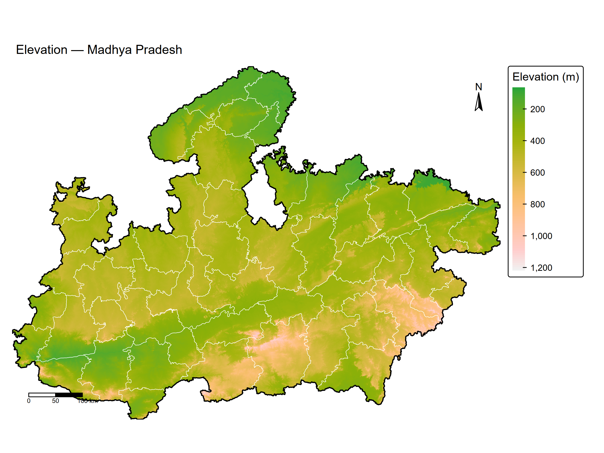
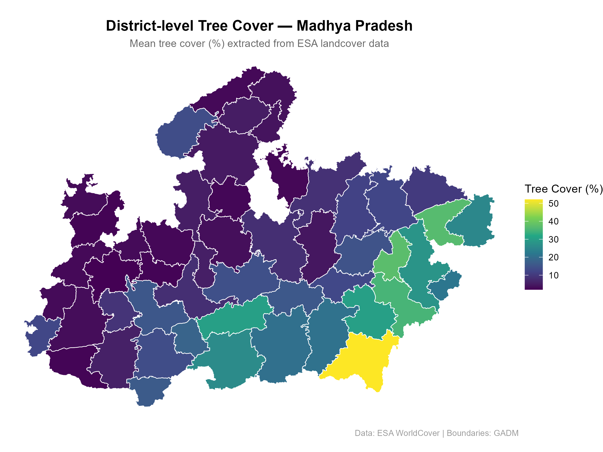
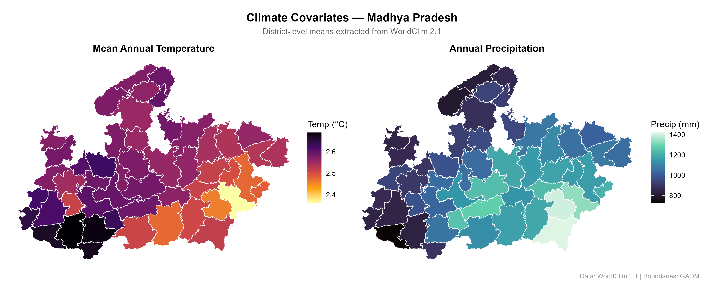

```{r setup, include=FALSE}
knitr::opts_chunk$set(echo = TRUE, warning = FALSE, message = FALSE)
library(terra)
library(sf)
library(tidyverse)
library(tmap)
library(exactextractr)
library(geodata)
library(viridis)
library(patchwork)
```

## 1. Introduction

This analysis extracts landscape-level environmental covariates across Madhya Pradesh, 
India, relevant to species distribution and occupancy modelling. Four environmental 
datasets were processed: a digital elevation model (DEM), bioclimatic variables 
(WorldClim 2.1), and tree cover (ESA WorldCover). District-level zonal statistics 
were computed using the `exactextractr` package, and results were visualised as 
publication-style maps.

Madhya Pradesh was selected as the study region due to its high ecological 
heterogeneity — spanning the Vindhya and Satpura hill ranges, the Maikal ridge, 
and the agricultural Malwa plateau — making it an informative landscape for 
covariate extraction exercises.

## 2. Data Sources

| Layer | Source | Resolution |
|---|---|---|
| Elevation (DEM) | SRTM via geodata | 30 arc-seconds |
| Bioclimatic variables | WorldClim 2.1 | 30 arc-seconds |
| Tree cover | ESA WorldCover via geodata | ~1 km |
| Administrative boundaries | GADM v4 | — |

## 3. Methods

### 3.1 Spatial Processing

All raster layers were clipped to the MP state boundary using `crop()` and `mask()` 
from the `terra` package. Layers were verified to share a common CRS (WGS84, EPSG:4326) 
prior to any spatial operations. Five bioclimatic variables were selected based on 
ecological relevance to species distribution modelling: mean annual temperature (BIO1), 
annual precipitation (BIO12), temperature seasonality (BIO4), precipitation seasonality 
(BIO15), and temperature annual range (BIO7).

### 3.2 Zonal Statistics

District-level summary statistics (mean, min, max, standard deviation) were extracted 
for each environmental layer using `exact_extract()` from the `exactextractr` package, 
which uses area-weighted coverage fractions for accurate polygon-raster intersection.

## 4. Results

### 4.1 Elevation

```{r load-data, echo=FALSE}
dem_mp         <- rast("data/processed/dem_mp.tif")
bioclim_select <- rast("data/processed/bioclim_mp.tif")
lc_mp          <- rast("data/processed/treecov_mp.tif")
district_stats <- read_csv("outputs/tables/mp_district_covariates.csv",
                           show_col_types = FALSE)
india_dist     <- gadm(country = "IND", level = 2, path = "data/raw")
mp_dist        <- india_dist[india_dist$NAME_1 == "Madhya Pradesh", ]
india          <- gadm(country = "IND", level = 1, path = "data/raw")
mp             <- india[india$NAME_1 == "Madhya Pradesh", ]
mp_wgs         <- project(mp, crs(dem_mp))
mp_dist_wgs    <- project(mp_dist, crs(dem_mp))
mp_dist_sf     <- st_as_sf(mp_dist_wgs)
mp_dist_plot   <- mp_dist_sf %>% left_join(district_stats, by = "NAME_2")
```

```{r map-elevation, echo=FALSE, fig.cap="Figure 1. Elevation across Madhya Pradesh. Higher terrain is concentrated in the Satpura and Vindhya ranges in southern MP."}

```

The five highest-elevation districts are concentrated in the Satpura-Maikal hill 
system in southern MP:

```{r elev-table, echo=FALSE}
district_stats %>%
  arrange(desc(elev_mean)) %>%
  select(District = NAME_2, 
         `Mean Elevation (m)` = elev_mean,
         `Max Elevation (m)`  = elev_max) %>%
  head(10) %>%
  knitr::kable(digits = 1)
```

### 4.2 Tree Cover

```{r map-tree, echo=FALSE, fig.cap="Figure 2. District-level mean tree cover (%) across Madhya Pradesh."}

```

Tree cover shows a strong south-east gradient, with the highest values in districts 
overlapping major protected areas — Balaghat (Kanha), Umaria (Bandhavgarh), and 
Sidhi (Sanjay-Dubri):

```{r tree-table, echo=FALSE}
district_stats %>%
  arrange(desc(tree_cover_mean)) %>%
  select(District = NAME_2,
         `Mean Tree Cover (%)` = tree_cover_mean) %>%
  head(10) %>%
  knitr::kable(digits = 1)
```

### 4.3 Climate Covariates

```{r map-climate, echo=FALSE, fig.cap="Figure 3. Mean annual temperature (left) and annual precipitation (right) by district."}

```

Temperature shows an inverse relationship with elevation as expected. Precipitation 
increases toward the south-east, consistent with the orographic effect of the 
Satpura range intercepting monsoon moisture.

## 5. Discussion

The extracted covariates capture the primary axes of environmental variation in 
Madhya Pradesh — elevation, temperature, precipitation, and vegetation cover. 
These variables are standard inputs for species distribution models (SDMs) and 
occupancy models, where landscape heterogeneity drives detection and occupancy 
probability.

The strong spatial structuring of tree cover around protected area boundaries 
(Kanha, Bandhavgarh, Sanjay-Dubri) suggests that administrative protection status 
is a meaningful predictor of habitat quality in this landscape, consistent with 
findings from Jhala et al. (2021) on tiger reserve effectiveness in central India.

## 6. Conclusion

A reproducible end-to-end pipeline was developed for extracting landscape-level 
ecological covariates across Madhya Pradesh. All data sources are publicly available 
and the analysis can be rerun or extended to additional regions with minimal 
modification. The district-level covariate table is available for downstream use 
in occupancy or species distribution modelling frameworks.

## 7. Session Info

```{r session-info, echo=FALSE}
sessionInfo()
```